# DevDesk

<p align="center">
  
</p>

> **個人ワークスペース型 IT 就職準備コミュニティプラットフォーム**  
> 履歴書、応募状況、面接日程、面接レビュー、学習記録を一つの空間で管理・共有できる Web サービスです。

<br />

## 📌 注意事項

本プロジェクトは、**Servlet/JSP、Oracle DB、Google OAuth2、Google Calendar API、reCAPTCHA** などの外部設定を必要とする Web アプリケーションです。

セキュリティ上、以下の情報は GitHub には含めていません。

- DB 接続情報
- Google OAuth2 Client ID / Client Secret
- Google Calendar API 認証情報および Refresh Token
- reCAPTCHA Site Key / Secret Key
- ローカル環境専用の設定ファイル

また、使用している Oracle DB は教育機関の内部ネットワーク環境に接続されているため、外部ネットワークから同一環境を再現することは困難です。  
そのため、本リポジトリでは **コード構成、実装内容、主要機能の画面キャプチャ** を中心にプロジェクト内容を確認できるようにしています。

<br />

## 📑 目次

1. [プロジェクト概要](#1-プロジェクト概要)
2. [主要画面](#2-主要画面)
3. [主要機能](#3-主要機能)
4. [担当範囲](#4-担当範囲)
5. [技術スタック](#5-技術スタック)
6. [システム構成](#6-システム構成)
7. [認証・権限フロー](#7-認証権限フロー)
8. [DB 設計概要](#8-db-設計概要)
9. [プロジェクト構成](#9-プロジェクト構成)
10. [プロジェクト確認方法](#10-プロジェクト確認方法)
11. [セキュリティ・例外処理](#11-セキュリティ例外処理)
12. [振り返り](#12-振り返り)

<br />

## 1. プロジェクト概要

**DevDesk** は、IT 就職準備生が採用情報の保存、応募ステータス管理、面接日程管理、面接レビューの作成・共有までを一つの流れで管理できる Web サービスです。

従来の就職準備では、スケジュール管理ツール、スプレッドシート、コミュニティ掲示板などが分かれており、情報が散らばりやすいという課題がありました。DevDesk では、個人ワークスペースとコミュニティ機能を組み合わせることで、個人の就職準備記録が自然に情報共有へつながる構造を目指しました。

| 項目 | 内容 |
| --- | --- |
| プロジェクト名 | DevDesk |
| 開発形態 | チームプロジェクト |
| チーム構成 | 5名 |
| 開発期間 | 2026.03 ~ 2026.04 |
| 主なユーザー | IT 就職準備生 |
| 核心価値 | 個人の就職準備管理 + 企業別面接レビュー共有 |

<br />

## 2. 主要画面

> 以下の画面は、ローカル環境で実行後にキャプチャした画像です。  
> 外部 API 認証キーおよび DB 接続情報は、セキュリティ上リポジトリに含めていません。

### メイン画面

サービスの初期画面です。ログイン、会員登録、主要メニューへ移動できます。

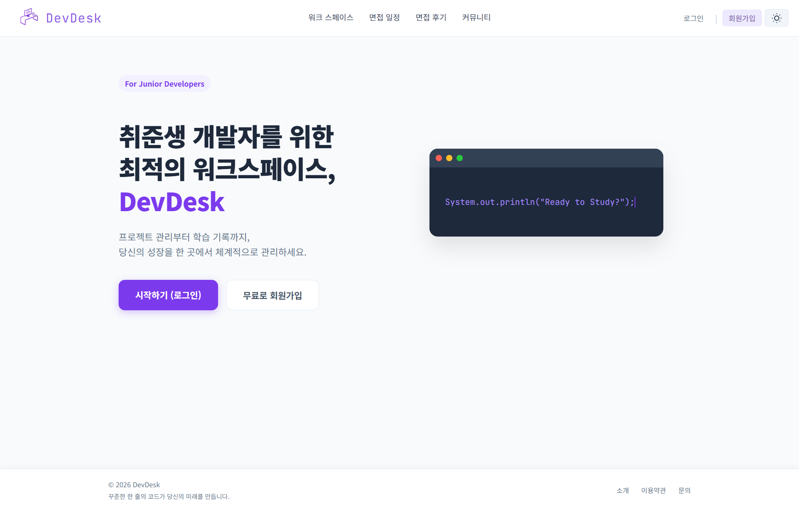

<br />

### ログイン

メールアドレスによる通常ログインと、Google OAuth2 ソーシャルログインの導線を提供しています。  
また、reCAPTCHA を適用し、自動化されたログイン試行を防止しました。

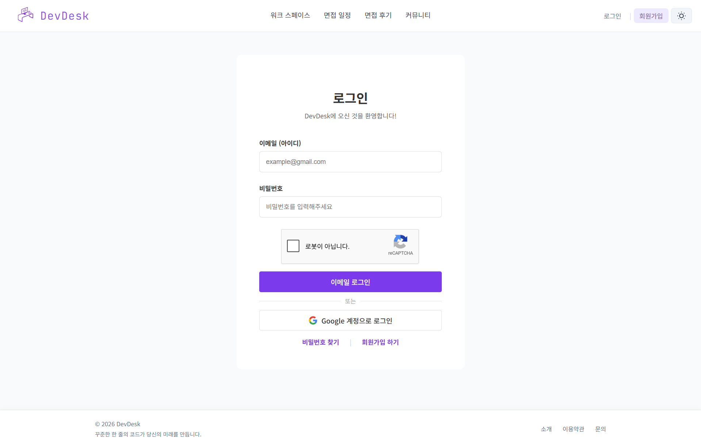

<br />

### 会員登録

メールアドレス重複確認、ニックネーム重複確認、パスワード規則チェック、関心職種の選択を通じて会員情報を登録できます。

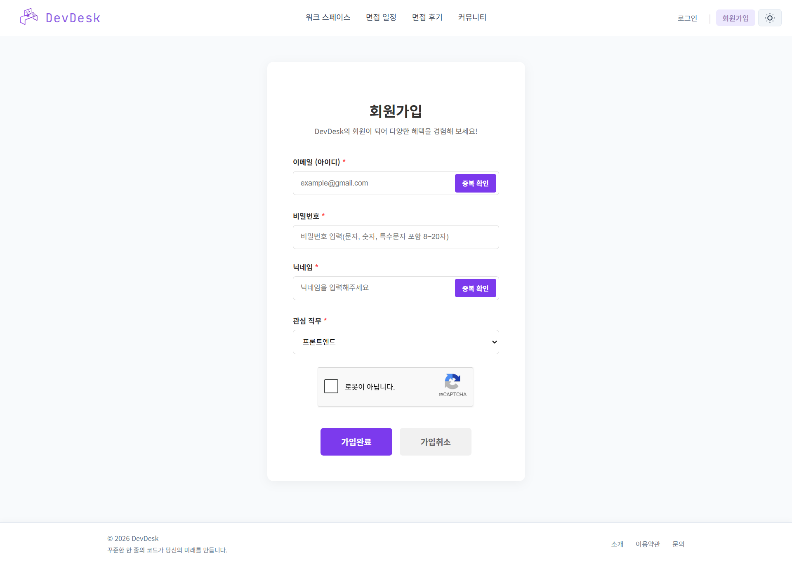

<br />

### マイページ

ユーザーはマイページで、プロフィール編集、パスワード変更、自分が作成した投稿・コメントの確認、退会処理を行うことができます。

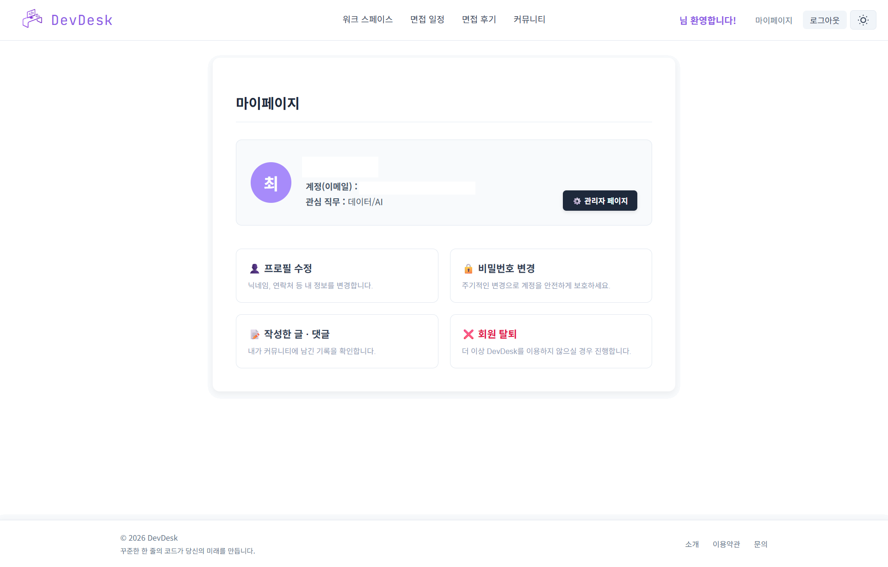

<br />

### 管理者ダッシュボード

管理者は、会員数、コミュニティ投稿数、新規会員数、職種カテゴリ分布、最近登録した会員情報を確認できます。

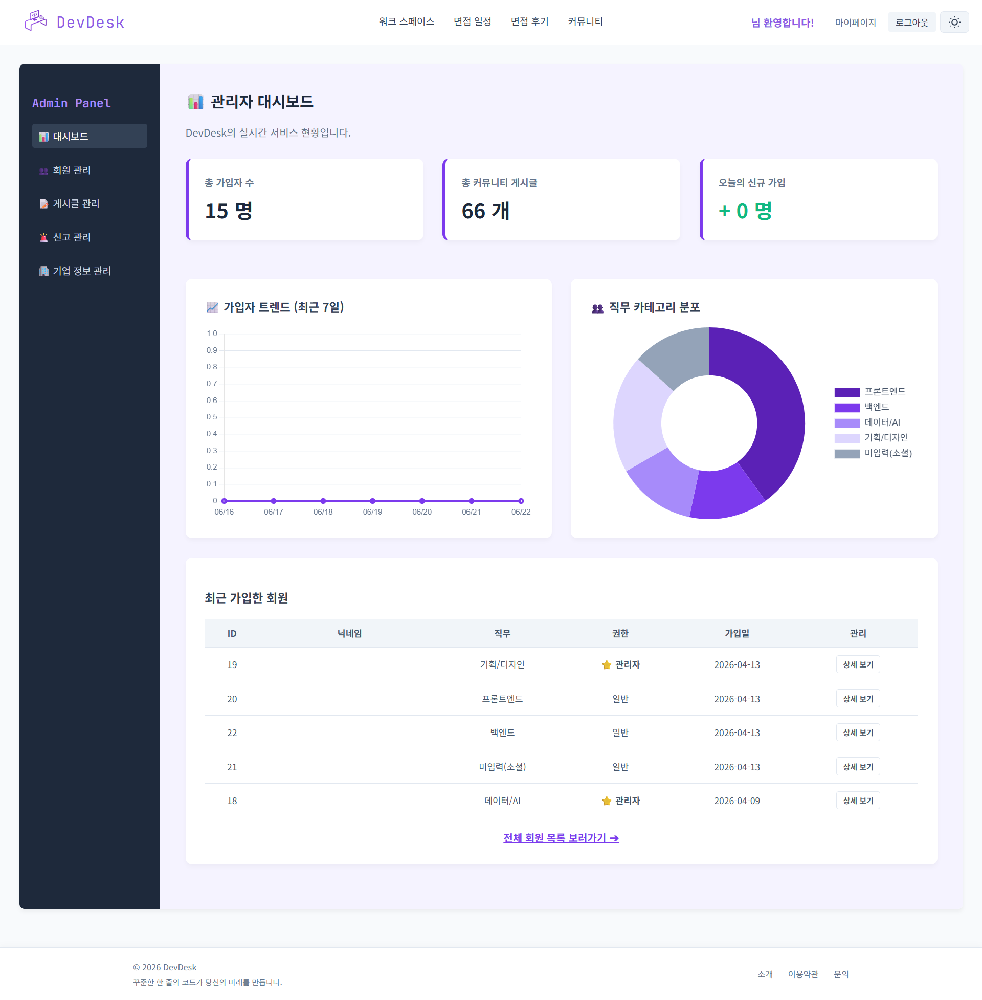

<br />

### 会員管理

管理者は、全会員一覧の確認、会員詳細確認、強制退会処理を行うことができます。

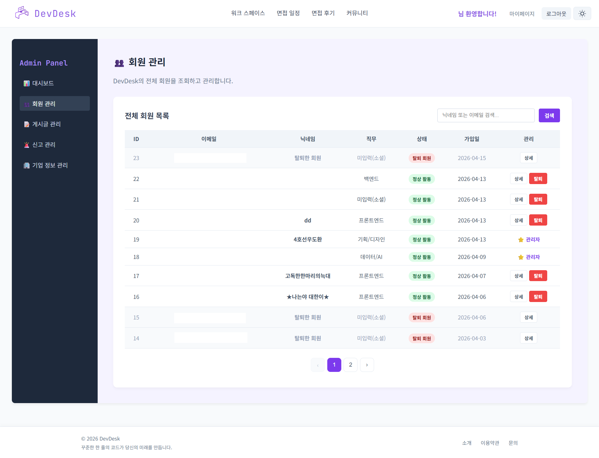

<br />

### 投稿管理

管理者は、コミュニティに登録された投稿を検索し、不適切な投稿を削除できます。

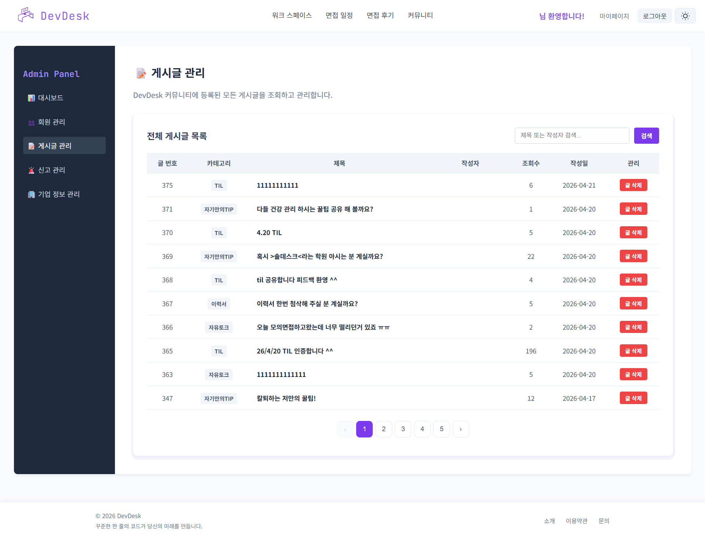

<br />

### 通報管理

通報された投稿またはコメントを確認し、処理状態を管理できます。

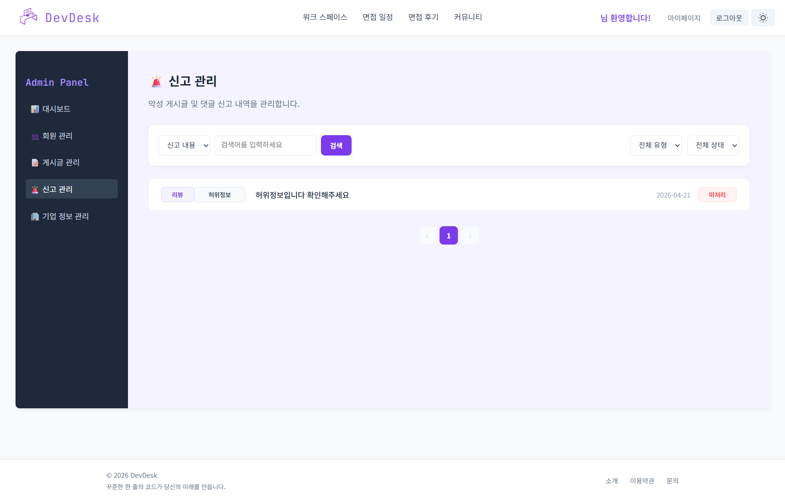

<br />

### 企業情報管理

ユーザーが登録した企業情報の承認、修正、削除、重複企業情報の整理を行うことができます。

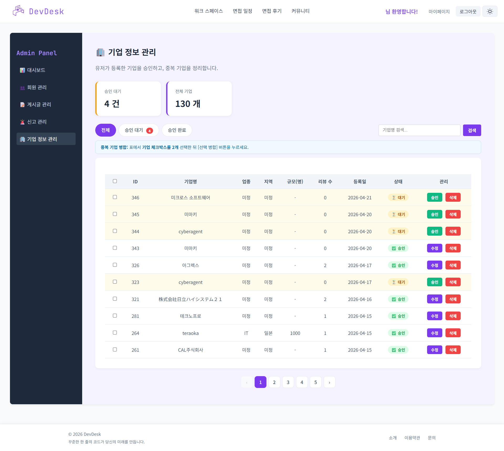

<br />

## 3. 主要機能

### 個人ワークスペース

- 応募状況の登録、照会、修正、削除
- 応募ステータス別管理およびお気に入り登録
- TIL 作成および学習時間記録
- 履歴書ブロックの登録、修正、バージョン管理
- 面接日程カレンダー管理

### コミュニティ

- 自由掲示板の投稿 CRUD
- コメント、返信コメント、いいね機能
- 企業検索および企業詳細ページ
- 企業別面接レビューの作成、修正、削除
- レビューのいいね、ブックマーク、閲覧数、タグ機能

### 会員管理

- 一般会員登録およびログイン
- メールアドレス重複確認、ニックネーム重複確認
- セッションベースのログイン状態維持
- Google OAuth2 ソーシャルログイン
- マイページ、プロフィール編集、パスワード変更・再設定
- 自分が作成した投稿およびコメントの確認
- 会員退会

### 管理者機能

- 管理者権限確認フィルター
- 会員一覧照会および強制退会
- 投稿管理および削除
- 通報管理
- 企業情報の承認、修正、削除、重複企業の統合
- 管理者ダッシュボード統計照会

<br />

## 4. 担当範囲

本プロジェクトでは、主に **会員機能、認証・認可フロー、マイページ、管理者機能** を担当しました。

| 区分 | 実装内容 | 主なファイル |
| --- | --- | --- |
| 会員登録 | 会員情報登録、メールアドレス重複確認、ニックネーム重複確認、登録完了画面処理 | `AccountC.java`, `CheckIdC.java`, `CheckNicknameC.java`, `MemberDAO.java` |
| ログイン / セッション | 通常ログイン、ログアウト、セッション保存、ログイン後の元ページ遷移 | `LoginC.java`, `LogoutC.java`, `LoginCheckFilter.java` |
| Google ログイン | OAuth2 認可コード処理、Access Token 要求、ユーザー情報取得、初回ログイン時の自動会員登録 | `GoogleLoginC.java`, `MemberDAO.java` |
| マイページ | プロフィール編集、パスワード変更、パスワード再設定、自分の投稿・コメント確認 | `MypageC.java`, `ProfileUpdateC.java`, `PasswordUpC.java`, `FindPasswordC.java`, `MyBoardC.java` |
| 会員退会 | パスワード検証後、個人ワークスペースデータ削除および会員情報の非識別化処理 | `DeleteAccountC.java`, `MemberDAO.java` |
| 管理者権限 | `/admin/*` へのアクセス権限確認、一般ユーザーのアクセス制御 | `AdminCheckFilter.java` |
| 管理者機能 | 会員管理、投稿管理、通報管理、企業承認・修正・削除、管理者ダッシュボード統計 | `AdminC.java`, `AdminDAO.java`, `AdminMemberC.java`, `AdminBoardC.java`, `AdminReportC.java`, `AdminCompanyC.java` |

<br />

### 実装ポイント

#### 1) セッションベースの認証フロー実装

ログイン成功時に `MemberDTO` をセッションに保存し、未ログインユーザーが保護されたページにアクセスした場合はログインページへ遷移するように実装しました。また、ログイン後にユーザーが本来アクセスしようとしていたページへ戻れるよう、リクエスト URL をセッションに保存しました。

```java
HttpSession hs = request.getSession();
hs.setAttribute("user", memberDTO);
hs.setMaxInactiveInterval(30 * 60);
```

#### 2) ログイン確認フィルターと管理者権限フィルターの分離

一般ログイン状態を確認する `LoginCheckFilter` と、管理者権限を確認する `AdminCheckFilter` を分離しました。これにより、一般ユーザー向けページと管理者ページのアクセス制御を明確に区別しました。

```java
@WebFilter(urlPatterns = {"/admin", "/admin/*"})
public class AdminCheckFilter implements Filter {
    // セッションの user.role が admin か確認
}
```

#### 3) Google OAuth2 ソーシャルログイン実装

Google OAuth2 の認可コードを受け取り、Access Token に交換した後、Google ユーザー情報を取得して既存会員かどうかを確認しました。初回ログインのユーザーは自動会員登録を行い、その後は通常ログインと同じセッション構造でログイン状態を維持するようにしました。

```text
Google 認可コード受信
→ Access Token 要求
→ ユーザー情報取得
→ 既存会員確認 / 新規会員登録
→ セッション保存
→ メインページへ移動
```

#### 4) 会員退会時のデータ整理方式設計

会員退会時は単純に会員 row を削除するのではなく、個人ワークスペース関連データは削除し、サービスの流れ上必要な投稿・コメント履歴は維持できるよう、会員情報を非識別化しました。複数テーブルを同時に処理するため、トランザクションを適用し、途中で失敗した場合はロールバックされるように構成しました。

```text
パスワード検証
→ schedule / application / til / resume 関連データ削除
→ member 個人情報の非識別化
→ status = 'deleted'
→ commit または rollback
```

#### 5) 管理者ダッシュボードおよび管理機能実装

管理者ページでは、全会員数、当日新規登録者数、職種分布、最近登録した会員などを確認できるよう SQL 集計ロジックを実装しました。また、企業承認状態（`is_verified`）の管理、投稿削除、通報処理、会員強制退会などの運用者向け機能を実装しました。

<br />

## 5. 技術スタック

### Backend

| 区分 | 技術 |
| --- | --- |
| Language | Java |
| Web | Servlet, JSP, JSTL |
| Server | Apache Tomcat |
| Build | Gradle, WAR |
| Database | Oracle DB |
| DB Access | JDBC, PreparedStatement, Apache Commons DBCP2 |
| JSON | Gson, json-simple, org.json |
| Scheduler | Quartz |
| External API | Google OAuth2, Google Calendar API, Google reCAPTCHA |

### Frontend

| 区分 | 技術 |
| --- | --- |
| View | JSP |
| Style | CSS |
| Script | JavaScript, jQuery, Fetch API |
| Calendar UI | FullCalendar |
| Chart | Chart.js |

<br />

## 6. システム構成

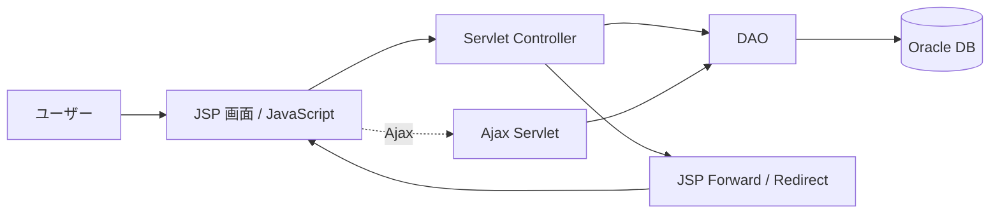

<br />

## 7. 認証・権限フロー

### 一般ログイン

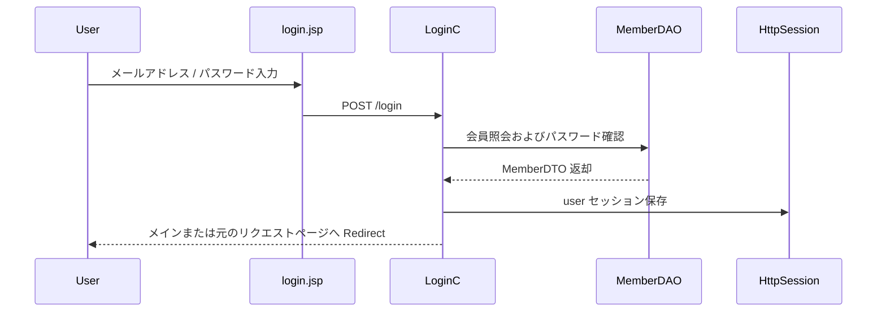

### 管理者アクセス制御

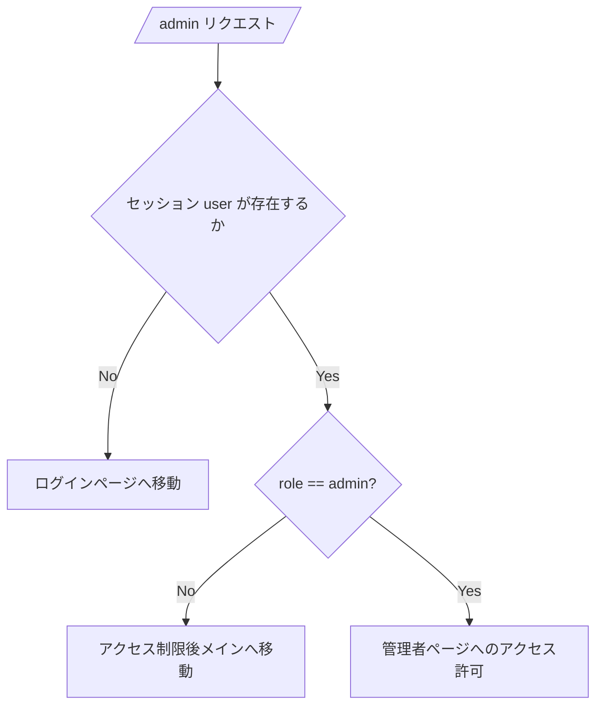

<br />

## 8. DB 設計概要

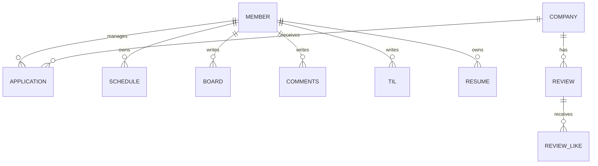

### 主要テーブル

| テーブル | 説明 |
| --- | --- |
| `member` | 会員情報、ログイン種別、権限、状態管理 |
| `application` | 企業応募状況および選考段階管理 |
| `schedule` | 面接日程および Google Calendar 連携情報 |
| `til` | 学習記録管理 |
| `resume`, `resume_field` | 履歴書およびカスタム項目管理 |
| `board`, `comments` | 自由掲示板およびコメント管理 |
| `company` | 企業情報管理 |
| `review` | 企業別面接レビュー管理 |
| `report` | 通報管理 |

<br />

## 9. プロジェクト構成

```text
src/main/java/com/devdesk/pj
├── admin          # 管理者ページ、会員/投稿/通報/企業管理
├── application    # 応募状況管理
├── auth           # ログイン/管理者アクセス制御フィルター
├── board          # 自由掲示板
├── calendar       # 面接日程および Google Calendar 連携
├── comment        # コメント/返信コメント
├── companysearch  # 企業検索および企業情報管理
├── dashboard      # 個人ダッシュボード
├── report         # 通報機能
├── resumeblock    # 履歴書ブロック管理
├── review         # 面接レビュー
├── til            # TIL
└── user           # 会員登録、ログイン、マイページ

src/main/webapp
├── admin
├── application
├── board
├── calendar
├── company
├── css
├── dashboard
├── js
├── report
├── resume-block
├── review
├── til
└── user
```

<br />

## 10. プロジェクト確認方法

本プロジェクトは教育課程で実施したチームプロジェクトであり、**正式にデプロイしたサービスではなく、ローカル実行を前提とした Web アプリケーション**です。

また、使用している Oracle DB は教育機関の内部ネットワークに接続されており、外部ネットワークでは同一の実行環境を再現することが困難です。Google OAuth2、Google Calendar API、reCAPTCHA などの外部連携機能も認証キーやトークンを必要とするため、セキュリティ上、関連設定ファイルおよび Secret 情報はリポジトリに含めていません。

そのため、本リポジトリでは実行手順を詳細に記載するのではなく、以下の内容を中心にプロジェクトを確認できるようにしています。

- 全体のコード構成
- 主要機能ごとの実装方式
- 担当範囲および実装ポイント
- DB 設計概要
- 主要画面キャプチャ
- セキュリティおよび例外処理方式

> 実際の画面は [主要画面](#2-主要画面) セクションのキャプチャ画像から確認できます。

<br />

## 11. セキュリティ・例外処理

- DB 接続情報、API Key、Secret Key、Refresh Token は GitHub にアップロードしないよう分離
- SQL 実行時は `PreparedStatement` によるパラメータバインディングを使用
- ログイン成功時にセッション有効時間を設定
- ログインが必要なページはフィルターで保護
- 管理者ページは `role = admin` のユーザーのみアクセス可能
- 会員退会および管理者による強制退会時にトランザクションを適用
- Google OAuth2、reCAPTCHA 設定値は外部設定ファイルとして分離
- 画面キャプチャでは個人情報およびアカウント情報をマスキング処理

<br />

## 12. 振り返り

今回のプロジェクトを通じて、Servlet/JSP ベースの MVC 構造におけるリクエスト処理の流れを整理し、ユーザーの認証状態や権限に応じてアクセス範囲を制御する経験を得ました。特に、会員退会や管理者による強制退会のように複数テーブルへ影響する機能を実装する中で、トランザクション処理とデータ整理方式の重要性を学びました。

また、Google OAuth2 ログインを既存の会員システムに連携する過程で、外部 API 連携では認証フロー、トークン処理、DB 保存構造をあわせて考慮する必要があることを実感しました。

---

© 2026 DevDesk
